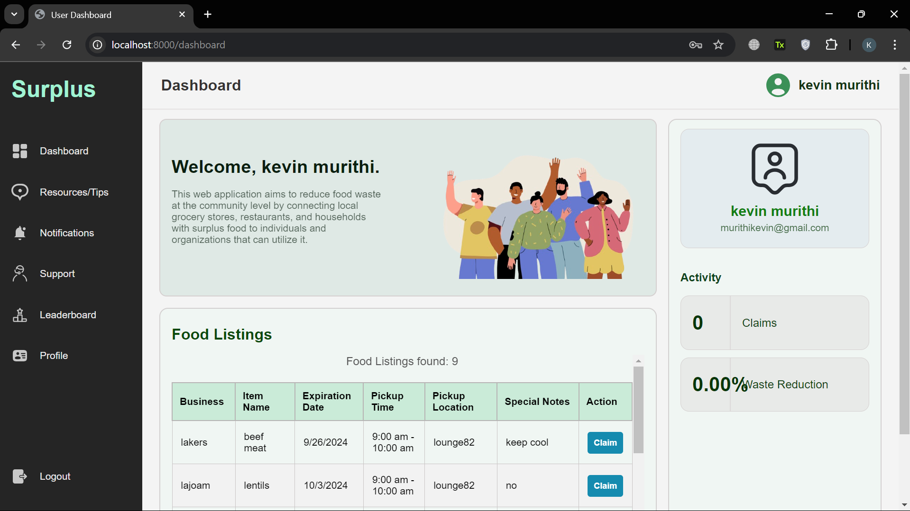
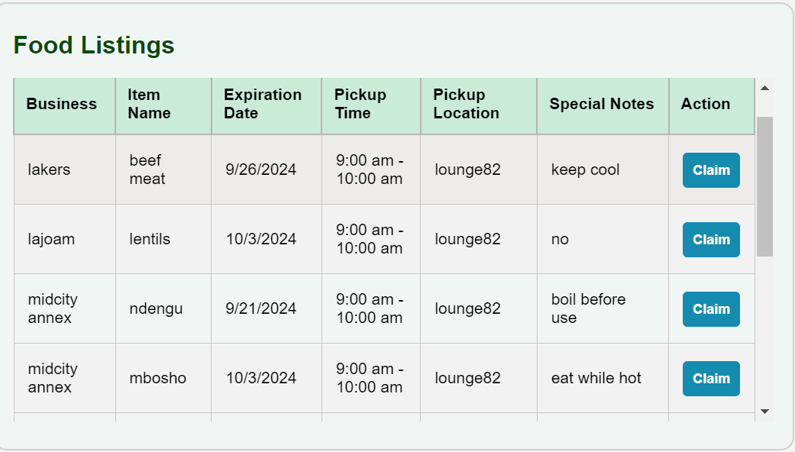
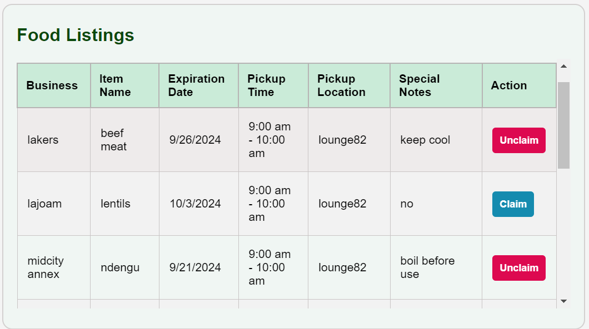

<<<<<<< HEAD
Community-Driven Food Waste Reduction Platform Documentation

    Project Title: "Community-Driven Food Waste Reduction Platform"

Overview:

This web application aims to reduce food waste at the community level by connecting local grocery stores, restaurants, and households with surplus food to individuals and organizations that can utilize it. The platform encourages a collaborative effort to combat food waste, promote sustainability, and support local communities by ensuring that edible food does not go to waste.

Objectives:

1.	Reduce Food Waste: Decrease the amount of food waste in local communities by making surplus food accessible to those in need.
2.	Promote Sustainability: Encourage sustainable practices among businesses and individuals.
3.	Support Local Communities: Provide a platform for local businesses and residents to contribute to a circular food economy.

Key Features:

1.	Surplus Food Listings:
o	Local businesses (grocery stores, restaurants, bakeries) can create listings of surplus food items that are nearing their expiration dates or are otherwise unsellable.
o	Users (community members or organizations) can browse these listings and claim food for free or at a reduced price.
2.	User Dashboard:
o	Each user has a personalized dashboard that shows their claimed food items, pick-up schedules, and statistics on how much food waste they have helped prevent.
o	Businesses also have dashboards to manage their food listings, track the food donated, and view metrics on their waste reduction efforts.
3.	Community Alerts:
o	Users can opt-in for real-time notifications about surplus food available in their vicinity.
o	Alerts can be customized based on preferences (e.g., type of food, distance, time).
4.	Food Waste Reduction Tips:
o	An educational resource section with articles, tips, recipes, and videos on reducing food waste at home, cooking with leftovers, and sustainable food storage practices.
5.	Geolocation and Mapping:
o	Integrates with mapping services (like Google Maps or OpenStreetMap) to show the location of food pickups, route directions, and estimated travel time.
o	Users can find the nearest available surplus food and plan pickups accordingly.

User Roles and Access:
1.	Business Users:
o	Can create an account, log surplus food items, and manage availability.
o	Receive notifications when food is claimed and arrange pickup times.
2.	Individual Users:
o	Create an account to browse surplus food listings, claim food items, and provide feedback.
o	View their contribution to waste reduction in their personalized dashboard.
3.	Administrator:
o	Manages the platform, verifies business accounts, monitors user activity, and ensures compliance with food safety and community guidelines.

Development Roadmap:
1.	Planning and Design:
o	Define the project scope, features, and user roles.
o	Design wireframes and mockups for the user interface.
o	Set up the project repository and initial structure.
2.	Backend Development:
o	Set up the server with Node.js and Express.
o	Create the database schema and connect it to the backend.
o	Develop API endpoints for user registration, login, food listing, and notifications.
3.	Frontend Development:
o	Implement the core components (landing page, dashboard, food listings, notifications).
o	Integrate mapping and geolocation features.
o	Add user interaction features like claiming food, notifications, and feedback.
4.	Integration and Testing:
o	Integrate frontend and backend services.
o	Conduct unit testing, integration testing, and user acceptance testing.
o	Optimize for performance and ensure cross-browser compatibility.
5.	Deployment and Monitoring:
o	Deploy the application to a cloud platform.
o	Set up monitoring tools for uptime, performance, and security.
o	Collect feedback from initial users and iterate on improvements.

Potential Challenges and Mitigation:
1.	Data Accuracy:
o	Ensuring real-time accuracy of surplus food listings can be challenging. Use real-time database updates and notifications to alert users about new listings or changes immediately.
2.	Food Safety and Regulations:
o	Ensure compliance with local food safety regulations, including guidelines for donating food. Provide disclaimers and verification processes for businesses listing food.
3.	User Engagement:
o	Use gamification and community-building strategies to keep users engaged and motivated to participate.

Expected Outcomes:

•	Impact on Community: Reduction in local food waste, increased awareness of sustainable practices, and strengthened community bonds.

•	Support for Local Businesses: Provide a channel for businesses to manage surplus efficiently, reduce waste disposal costs, and contribute to the community.

•	Platform Growth: Potential to scale to multiple communities and expand features, such as partnerships with more local charities or integrating with municipal waste management programs.

Table of Contents
1.	System Requirements

    •	Node.js (version X.X.X)

    •	MySQL (version X.X.X)

    •	A modern web browser (Chrome, Firefox, Safari, etc.)

3.	User Guide
 
    This is a brief overview of things that will be described below in this documentation.

        o	Creating a User Account

        o	Logging In

        o	Dashboard Overview

        o	Claiming Food

        o	Unclaiming Food

        o	Viewing Notifications

        o	Resources/Tips

        o	Contact Support

        o	Logging Out

4.	Business Guide

    This is a brief overview of things that will be described below in this documentation.

        o	Creating a Business Account

        o	Logging In

        o	Dashboard Overview for Businesses

        o	Creating Food Listings

        o	Removing Food Listings

        o	Viewing Notifications

        o	Resources/Tips for Businesses

        o	Contact Support for Businesses

        o	Logging Out

5.	Conclusion

6.	Appendix

System Requirements

        •	Node.js (version X.X.X)
        •	MySQL (version X.X.X)
        •	A modern web browser (Chrome, Firefox, Safari, etc.)

Getting Started

    Installation
    1.	Clone the repository:
    
    git clone <repository-url>

    2.	Navigate to the project directory:
    
    cd <project-directory>

    3.	Install dependencies:
   
    npm install

User Guide

    Creating a User Account
        1.	Navigate to the Registration Page:
        o	Go to the /signUP URL.

        2.	Fill in the Registration Form:
        o	Enter a username, email, and password.
        o	Click the Register button.

    Logging In

        1.	Navigate to the Login Page:
        o	Go to the /signIn URL.

        2.	Enter Your Credentials:
        o	Input your email and password.
        o	Click the Login button.

    Dashboard Overview

        1.	After logging in, you will be redirected to your dashboard.
        o	This page displays your claimed food items, notifications, and additional features.
        
	

    Claiming Food

        1.	Browse Available Listings:
        o	Navigate through the food listings on your dashboard.

        2.	Claim an Item:
        o	Click on the Claim button next to the desired food item.
        o	You will receive a confirmation notification.
        
	

    Unclaiming Food
        1.	Go to Claimed Items:
        o	View your claimed food items on the dashboard.

        2.	Unclaim an Item:
        o	Click on the Unclaim button next to the food item you wish to unclaim.
        o	A notification will confirm that the item has been unclaimed.

    Viewing Notifications
        1.	Access Notifications:
        o	Click on the Notifications tab in your dashboard.
        o	This section displays all notifications related to claimed food and other alerts.

        
    Resources/Tips
        1.	Navigate to the Resources/Tips Section:
        o	Click on the Resources/Tips tab in your dashboard.
        o	This section provides valuable information on how to reduce food waste.

        2.	View Tips:
        o	Browse practical tips and resources provided.
        o	You can also view videos and learn about reducing food waste in your community.

    Contact Support
        1.	Navigate to the Support Section:
        o	Click on the Support tab in your dashboard.
        o	This section allows you to contact support for assistance.
	

        2.	Send a Support Message:
        o	Fill out the support form and submit your inquiry.

    Logging Out
        1.	Log Out from the Dashboard:
        o	Click the Logout button.
        o	A confirmation prompt will appear asking if you really want to logout.
	

Business Guide

    Creating a Business Account
        1.	Navigate to the Business Registration Page:
        o	Go to the /bizsignUP URL.
	

        2.	Fill in the Registration Form:
        o	Enter your business name, email, and password.
        o	Click the Register button.

    Logging In
        1.	Navigate to the Business Login Page:
        o	Go to the /bizsignIn URL.
 
 

        2.	Enter Your Credentials:
        o	Input your business email and password.
        o	Click the Login button.
	

    Dashboard Overview for Businesses
        1.	After logging in, you will be redirected to your business dashboard.
        o	This page displays your food listings, notifications, and additional features.

    Creating Food Listings
        1.	Go to Your Dashboard:
        o	After logging in, you will be redirected to your business dashboard.

        2.	Add a Food Listing:
        o	Fill out the form with food details (name, category, quantity, etc.).
        o	Click the Submit button to create the listing.

	

    Removing Food Listings
        1.	View Your Food Listings:
        o	Navigate to the section displaying your created listings.

        2.	Remove a Listing:
        o	Click the Remove button next to the food item you want to delete.
        o	A notification will confirm that the item has been removed.
	

    Viewing Notifications
        1.	Access Notifications:
        o	Click on the Notifications tab in your dashboard.
        o	This section displays all notifications related to your food listings.
	

    Resources/Tips for Businesses
        1.	Navigate to the Resources/Tips Section:
        o	Click on the Resources/Tips tab in your dashboard.
        o	This section provides valuable information tailored for businesses on reducing food waste.
	

        2.	View Tips:
         o	Browse practical tips and resources provided.
         o	You can also view videos and learn about reducing food waste in your operations.
	

    Contact Support for Businesses
        1.	Navigate to the Business Support Section:
        o	Click on the Support tab in your dashboard.
        o	This section allows you to contact support for assistance specific to your business.
	

        2.	Send a Support Message:
        o	Fill out the support form and submit your inquiry.
	

    Logging Out
        1.	Log Out from the Business Dashboard:
        o	Click the Logout button.
        o	A confirmation prompt will appear asking if you really want to logout.
        

Conclusion

This documentation provides a comprehensive guide to using the community-driven food waste reduction platform for both users and businesses. By following these instructions, users can effectively navigate the system to create accounts, manage food listings, and utilize all available features.
=======
# PLPFINALPROJECT
>>>>>>> 64a677880c4d7270a1ff84007b622763c79486e8

